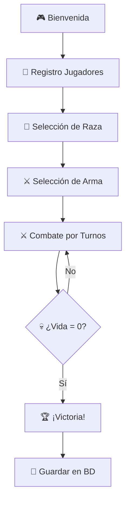

# 🛡️ Videojuego de Combate por Turnos

<div align="center">


> **Un emocionante juego de combate por turnos desarrollado en Java con NetBeans**  
> *Programación orientada a objetos • Herencia • Menús por consola • Persistencia en base de datos*

</div>

---

## 🎮 **Descripción del Juego**

<table align="center">
<tr>
<td width="50%">

### ⚔️ **Características Principales**
- 🥊 **Combate por turnos** estratégico
- 👥 **Modo 2 jugadores** local
- 🏹 **4 razas únicas** con habilidades especiales
- 🗡️ **Sistema de armas** diversificado
- 📏 **Mecánica de distancia** táctica
- 💾 **Persistencia completa** en SQL Server

</td>
<td width="50%">

### 🌟 **Objetivos**
Elige tu raza, selecciona tu arma y enfréntate en combate épico. Usa estrategia, gestión de distancia y habilidades únicas como **sanación**, **sangrado** o **ataques a distancia** para derrotar a tu oponente y reducir su vida a **0**.

</td>
</tr>
</table>

---

## 📋 **Requisitos del Sistema**

<div align="center">

| Componente | Versión Mínima | Descripción |
|------------|----------------|-------------|
| ☕ **Java** | 11 o superior | Entorno de ejecución |
| 🔧 **NetBeans IDE** | Cualquier versión | Con soporte Ant |
| 🗄️ **SQL Server** | Express/Standard | Base de datos |
| 📚 **JDBC Driver** | `mssql-jdbc` | Controlador de conexión |
| 🔐 **Autenticación** | Windows | Conexión directa |

</div>

---

## 🚀 **Guía de Instalación y Ejecución**

### 🗄️ **Paso 1: Configurar Base de Datos**

```sql
-- 1. Abre SQL Server Management Studio (SSMS)
-- 2. Ejecuta el script crear_base_datos.sql
-- 3. Verifica que todas las tablas estén creadas correctamente
```

<details>
<summary><strong>📊 Ver estructura de tablas</strong></summary>

- `🏷️ raza`: id, nombre, descripcion
- `⚔️ arma`: id, nombre, tipo, dano_minimo, dano_maximo, modificadores  
- `👤 jugador`: id, nombre, partidas_ganadas, partidas_perdidas
- `🧙‍♂️ personaje`: id, nombre, id_raza, fuerza, energia, vida_actual, id_arma, id_jugador
- `🎯 partida`: id, id_jugador_ganador, id_jugador_perdedor, fecha, razon

</details>

### ⚙️ **Paso 2: Configurar NetBeans**

1. **Abrir proyecto** en NetBeans
2. **Propiedades del Proyecto** → **Libraries** → **Add JAR/Folder**
3. **Agregar** `mssql-jdbc-*.jar`
4. **Run** → **VM Options**:
   ```
   -Djava.library.path=C:\\sql --enable-native-access=ALL-UNNAMED
   ```

### ▶️ **Paso 3: Ejecutar**

```bash
# Presiona F6 en NetBeans o haz clic en Run
# El juego iniciará automáticamente en la consola
```

---

## 🕹️ **Cómo Jugar**

### 🎯 **Flujo del Juego**



### 🏹 **Razas Disponibles**

<table align="center">
<tr>
<td align="center" width="25%">

**🧍‍♂️ HUMANO**  
*Especialista en armas de fuego*
- 🔫 **Escopeta**
- 🎯 **Rifle Francotirador** 
- 💪 Daño consistente

</td>
<td align="center" width="25%">

**🧙‍♂️ ELFO**  
*Maestro de la magia elemental*
- 🔥 **Magia de Fuego**
- 🌍 **Magia de Tierra**
- 💨 **Magia de Aire**
- 💧 **Magia de Agua** (+90% sanación)

</td>
<td align="center" width="25%">

**🤖 ORCO**  
*Guerrero brutal cuerpo a cuerpo*
- 🪓 **Hacha** (causa sangrado)
- 🔨 **Martillo**
- 🩸 Efecto sangrado (-3 vida/2 turnos)

</td>
<td align="center" width="25%">

**🐺 BESTIA**  
*Luchador salvaje y ágil*
- 👊 **Puños**
- ⚔️ **Espada**
- 🏃‍♂️ Agilidad natural

</td>
</tr>
</table>

### ⚔️ **Mecánicas de Combate**

<div align="center">

| Acción | Descripción | Efectos |
|--------|-------------|---------|
| 🚶‍♂️ **Avanzar/Retroceder** | Cambiar distancia | Necesario para atacar (≤1m) |
| ⚔️ **Atacar** | Infligir daño | Según arma y distancia |
| 💚 **Sanar** | Recuperar vida | Consume turno completo |

</div>

---

## 🏗️ **Arquitectura del Proyecto**

```
🎮 videojuego-turnos/
┣━━ 📂 src/
┃   ┣━━ 📂 Main/
┃   ┃   ┗━━ 📄 Main.java
┃   ┣━━ 📂 datos/
┃   ┃   ┣━━ 📄 ConexionBD.java
┃   ┃   ┣━━ 📄 JugadorDAO.java  
┃   ┃   ┣━━ 📄 PersonajeDAO.java
┃   ┃   ┗━━ 📄 PartidaDAO.java
┃   ┣━━ 📂 entidades/
┃   ┃   ┣━━ 📄 Jugador.java
┃   ┃   ┣━━ 📄 Raza.java
┃   ┃   ┗━━ 📄 Arma.java
┃   ┣━━ 📂 modelos/
┃   ┃   ┣━━ 📄 Personaje.java
┃   ┃   ┣━━ 📄 Humano.java
┃   ┃   ┣━━ 📄 Elfo.java
┃   ┃   ┣━━ 📄 Orco.java
┃   ┃   ┗━━ 📄 Bestia.java
┃   ┗━━ 📂 juego/
┃       ┗━━ 📄 Juego.java
┣━━ 📂 db/
┃   ┣━━ 📄 crear_base_datos.sql
┃   ┗━━ 📂 backup/
┃       ┗━━ 📄 videojuego_turnos.bak
┗━━ 📄 README.md
```

### 🔧 **Patrones de Diseño Implementados**

- **🏗️ DAO (Data Access Object)**: Separación de lógica de datos
- **🧬 Herencia**: Jerarquía de personajes por raza
- **📦 Encapsulamiento**: Propiedades privadas y métodos públicos
- **🔧 Factory Pattern**: Creación de personajes según raza

---

## 💾 **Sistema de Persistencia**

<div align="center">

### 🗄️ **Conexión JDBC con SQL Server**

```java
// Configuración de conexión automática
String connectionUrl = "jdbc:sqlserver://localhost:1433;"
    + "databaseName=videojuego_turnos;"
    + "integratedSecurity=true;"
    + "encrypt=false;";
```

**📈 Datos persistidos:**
- ✅ Información de jugadores
- ✅ Estadísticas de partidas  
- ✅ Configuración de personajes
- ✅ Historial de combates

</div>

---

## 👥 **Equipo de Desarrollo**

<table align="center">
<tr>
<td align="center">

### 👨‍💻 **Jairo Herrera**
**🏗️ Arquitecto Principal**
- Diseño de clases y herencia
- Lógica de combate
- Base de datos y persistencia
- Integración JDBC

</td>
<td align="center">

### 👨‍💻 **[Tu Compañero]**
**🎨 Desarrollador Frontend**
- Menús interactivos
- Flujo del juego
- Integración DAO
- Testing y debugging

</td>
</tr>
</table>

---

## 🖼️ **Capturas del Juego**

### 🎮 **1. Pantalla de Bienvenida**
```
╔═════════════════════════════════════════════════════════╗
║                                                         ║
║        🛡️  BIENVENIDO AL VIDEOJUEGO  🛡️              ║
║            🔥 DE COMBATE POR TURNOS 🔥                 ║
║                                                         ║
║            ⚔️  ¡Que gane el mejor!  ⚔️                 ║
║                                                         ║
╚═════════════════════════════════════════════════════════╝
```

### 🏹 **2. Selección de Raza**
```
🎮 JAIRO, ELIGE TU RAZA:

1. 🧍‍♂️ HUMANO    → Armas de fuego (Escopeta, Rifle)
2. 🧙‍♂️ ELFO      → Magia elemental (Fuego, Tierra, Aire, Agua)  
3. 🤖 ORCO      → Combate cuerpo a cuerpo (Hacha, Martillo)
4. 🐺 BESTIA    → Lucha salvaje (Puños, Espada)

👉 Ingresa tu elección (1-4): █
```

### ⚔️ **3. Combate en Acción**
```
═══════════════════════════════════════════════════════════════════
                            ⚔️ TURNO 1 ⚔️                          
═══════════════════════════════════════════════════════════════════

📊 ESTADO ACTUAL DEL COMBATE:
┌────────────────────────────────────────────────────────────────┐
│  👤 Carlos  │  ❤️ Vida: 100/100  │  🔫 Arma: Escopeta         │
│  👤 Ana     │  ❤️ Vida: 115/115  │  💧 Arma: Báculo Agua      │
│  📏 Distancia entre combatientes: 4 metros                    │
└────────────────────────────────────────────────────────────────┘

🎯 CARLOS - ¡ES TU TURNO!

1. 🏃‍♂️ Avanzar     2. 🚶‍♂️ Retroceder     3. ⚔️ Atacar     4. 💚 Sanar

👉 Selecciona tu acción: █
```

---

## 📚 **Recursos Adicionales**

<div align="center">

| 📁 **Archivo** | 📝 **Descripción** |
|---------------|-------------------|
| `crear_base_datos.sql` | Script completo de creación de BD |
| `videojuego_turnos.bak` | Backup de base de datos |
| `README.md` | Manual de usuario completo |

</div>

---

## 🏆 **Características Técnicas Destacadas**

<table align="center">
<tr>
<td width="50%">

### ✨ **Funcionalidades**
- ✅ POO completa con herencia
- ✅ Patrón DAO implementado  
- ✅ Try-with-resources para BD
- ✅ Manejo de excepciones robusto
- ✅ Interfaz de consola intuitiva
- ✅ Sistema de distancia tactical

</td>
<td width="50%">

### 🎯 **Cumplimiento de Requisitos**
- ✅ Programación orientada a objetos
- ✅ Herencia y polimorfismo
- ✅ Menús interactivos por consola
- ✅ Persistencia en SQL Server
- ✅ Documentación completa
- ✅ Listo para presentación

</td>
</tr>
</table>

---

<div align="center">

## 🌟 **¡Listo para la Batalla!** 🌟

**Desarrollado con ❤️ usando Java • NetBeans • SQL Server**

---

### 🎮 *¡Que comience la épica batalla por turnos!* ⚔️

**[⭐ Dale una estrella si te gustó el proyecto ⭐]**

---

*© 2024 - Proyecto Académico • Videojuego de Combate por Turnos*

</div>